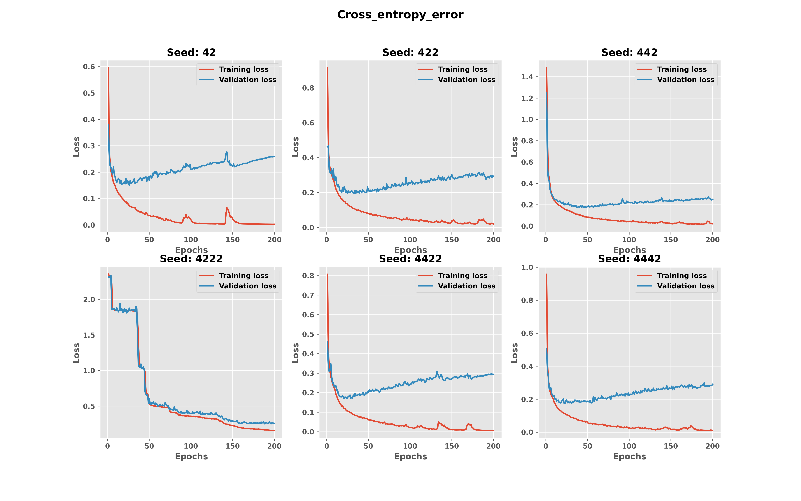

###### GR5241 Spring 2022
# **Project Milestone 2: Deep Learning Part**
## **Name: Kangshuo Li &ensp; &ensp; &ensp; &ensp; &ensp; &ensp; &ensp; &ensp; UNI: kl3259**

 

## **Part 4: Deep Learning**

 

### **3. (5 points) Train a single layer neural network with 100 hidden units (e.g. with architecture: 784 → 100 → 10). You should use the initialization scheme discussed in class and choose a reasonable learning rate (i.e. 0.1). Train the network repeatedly (more than 5 times) using different random seeds, so that each time, you start with a slightly different initialization of the weights. Run the optimization for at least 150 epochs each time. If you observe underfitting, continue training the network for more epochs until you start seeing overfitting.**
 

    The structure of single layer neural network is:
    single_layer_NN(
    (flatten): Flatten(start_dim=1, end_dim=-1)
    (single_layer_nn): Sequential(
    (0): Linear(in_features=784, out_features=100, bias=True)
    (1): Sigmoid()
    (2): Linear(in_features=100, out_features=10, bias=True)
    )
    )

In this case we only construct one hidden layer with 784 original inputs, 100 neurons and the sigmoid function as activation function. The output size is 10 which corresponds to the number of classes in MNIST dataset. 

 

#### **(a)** Plot the average training cross-entropy error (sum of the cross-entropy error terms over the training dataset divided by the total number of training example) on the y-axis vs. the epoch number (x-axis). On the same figure, plot the average validation cross-entropy error function. Examine the plots of training error and validation/test error (generalization). How does the network’s performance differ on the training set versus the validation set during learning? Use the plot of training and testing error curves to support your argument.
 

The leanring curves with respect to cross-entropy error of all 6 random initializations are shown above. 

In this question, we set the learning rate $l = 0.1$, and $N_{epochs} = 200$ with batch size $N_{batch} = 64$. Since we used a setup that requires sufficient epochs to attain a status like overfitting, we can note that most of the training processes have a pattern of overfitting. The training errors are smaller than the test error. In axes of seed 42, 422, 442, 4422, and 4442, the cross-entropy loss started from different values with different initializations and decreased quickly in the first 25 epochs, then as the number of training epochs increased, the cross-entropy error slowly decreased to 0 with some fluctuations while the validation(test set here) cross-entropy error slightly increased from 0.2 to around 0.3, so these plots show that Their corresponding training process involves overfitting. In other words, the single neural networks began to become weaker for generalization while still working well on the training set.

Also note that the training process with seed 4222 got an unique learning curve, which includes a much higher initial cross-entropy loss and the learning process has several cliff drops and ends up with no significant overfitting pattern. This could be the result of a relatively unlucky initialization with parameters that were far from the local optimal point. Finally it also got the training error close to 0 and validation error close to 0.3, but the time cost to attained same performance is higher than the other random initializations. 

 

#### **(b)** We could implement an alternative performance measure to the cross entropy, the mean miss-classification error. We can consider the output correct if the correct label is given a higher probability than the incorrect label, then count up the total number of examples that are classified incorrectly (divided by the total number of examples) according to this criterion for training and validation respectively, and maintain this statistic at the end of each epoch. Plot the classification error (in percentage) vs. number of epochs, for both training and testing. Do you observe a different behavior compared to the behavior of the cross-entropy error function?
 

The learning curves with respect to misclassification error of all 6 random initializations are shown above. 

The learning curves of average misclassification error are pretty similar to learning curves based on cross-entropy error. They have the same quick decreasing sections in the first 25 epochs and overfitting sections corresponding to the remaining epochs, and all the fluctuations are at the same pace. Seed 4222 also got cliff drops in this learning curve and takes a longer time to earn the same performance as other neural networks. 

However, note that the overfitting parts of these plots are different from those in cross-entropy loss, the validation means misclassification error with seeds 42, 422, 442, 4422, and 4442 nearly maintaining the same value with some little noise in the overfitting phase, and the training loss of mean misclassification keep decreasing to 0. In the previous question, the cross-entropy error on test set was slowly increasing. If we measure the ability of generalization of the neural networks by using mean misclassification error, then this ability is not damaged by overfitting. 

 

#### **(c)** Visualize your best results of the learned W as one hundred 28×28 images (plot all filters as one image, as we have seen in class). Do the learned features exhibit any structure?
 

The table of evaluation metrics is shown above. 

We select the best model based on mean misclassification error on test set standing for the test accuracy and the cross-entropy error on test set. Singel layer neural network with seed 42 has the lowest mean test misclassification error and relatively low test cross-entropy error, so we identify it as the best model. 

This is the visualization of the parameters learned from the best model with seed 42. It's clear that the most frequent pattern is the feature like a shape of "3" with a shade like a shape of "8". There are also some chaotic features and some features with only part of the number or strokes shown in the restored features. The patterns like "3" frequently appeared might be the result from severely overfitting, as the learning process led the weights to a local optimal that mainly recognizing "3" or "8". 

 

#### **(d)** Try different values of the learning rate. You should start with a learning rate of 0.1. You should then reduce it to .01, and increase it to 0.2 and 0.5. What happens to the convergence properties of the algorithm (looking at both average cross entropy and % incorrect)? Try momentum of 0.0, 0.5, 0.9. How does momentum affect convergence rate? How would you choose the best value of these parameters?
 

We trained the best model with random seed 42 on the grid of learning rate $lr = \{0.01, 0.02, 0.05, 0.1, 0.2, 0.5\}$ and momentum $momemtum = \{0.0, 0.5, 0.9\}$. 

According to these 2 figures, both cross-entropy error and mean misclassification error have the same learning pattern when the learning rate and momentum are the same. With fixed momentum, a larger learning rate would lead to higher error rate and higher gap between training and testing error in terms of both the cross-entropy error and misclassification error. With a fixed learning rate, as the momentum increases, we can see that the learning curves are becoming less stable and even cannot make optimization on the loss function or even diverge. One important thing here is that single layer neural networks with lower learning rates seem to have better convergence rates than those with large learning rates. 

This table shows the evaluation metrics of all single layer NNs trained on the learning rate and momentum grid with the best random seed 42 picked in 3(c). The best parameters should be chosen by the learning curve that have stable learning process and higher test accuracy and lower test cross-entropy error. Since the value of average cross-entropy error on test set is sensitive to overfitting, we can choose the best single layer neural network with parameters:
* $Seed = 42, lr = 0.01, momentum = 0.0$

since it got the lowest test average cross-entropy error and the highest test accuracy. 

 

### **4. (5 points) Redo part 3(a) - 3(d) with a CNN i.e. with one 2-D convolutional layers → Relu activation → Maxpooling with appropriate hyperparameters. Compare the best result from the single layer neural network and the CNN, what could you conclude?**
 

    The structure of the single convolutional layer CNN is:
    CNN(
    (conv): Sequential(
        (0): Conv2d(1, 16, kernel_size=(5, 5), stride=(1, 1), padding=(2, 2))
        (1): ReLU()
        (2): MaxPool2d(kernel_size=(2, 2), stride=2, padding=0, dilation=1, ceil_mode=False)
    )
    (flatten): Flatten(start_dim=1, end_dim=-1)
    (single_layer_nn): Sequential(
        (0): Linear(in_features=3136, out_features=10, bias=True)
    )
    )

We define the only convolutional layer by using $5 \times 5$ kernel size and a padding of 2 in both vertical and horizontal direction and moves the convolution kernel with stride 1. This conv2d layer would output the data in shape $(16, 28, 28)$. Then after ReLU activation, the features would be reduced to $(16, 14, 14)$ by the MaxPooling layer and flattened by the Flatten layer in to a fully connected layer. The number of output neurons is set to be the number of classes. 

#### **(a) & (b)**
 

The learning curves of CNNs are listed above. The training parameters are: $lr = 0.001$, $N_{batch} = 100$, $N_{epoch} = 80$, $momentum = 0$. I reduced the number of epochs since the CNN is more suitable for computer vision problems, thus it would perform better than single layer NN, we can observe the overfitting under fewer epochs. 

We can still see that the patterns in single layer NNs' learning curve also appear in CNNs' figure. The single convolutional layer CNN has the convergence rate as same as the single layer NN, both types can attain a status of overfitting at around the 20th epoch. Note that both two types of training errors and testing errors are lower than single layer NN when the training processes are finished, which conforms with the conclusion that CNN has better performance on image classification than single layer NN. The main reason is that its convolutional layer can work as a feature extractor and maxpooling layer can be interpreted as dimension reduction. 

Also, there's less fluctuation during the training process in CNNs' learning curve. 

 

#### **(c)**
 

Model comparison between CNNs is based on this table. 

All CNNs have similar overfitting patterns starting from around the 10th epoch. The best model is CNN with seed 42 as it has the lowest test average cross-entropy error and lowest mean misclassification error. 

The visualization of the 16 convolutional kernel from the best single convolutional layer CNN shows some of the structures like the part of strokes with black and white pixels. The kernels are seem to be uncorrelated, which are reasonable. 

 

#### **(d)**

The learning curves with respect to two types of errors on the learning rate and momentum grid are shown above. 

We trained the best single convolutional layer CNN with random seed 42 on the grid of learning rate $lr = \{0.0001, 0.0005, 0.001, 0.002, 0.005, 0.01\}$ and momentum $momemtum = \{0.0, 0.5, 0.9\}$. Since we already observed the overfitting around the 20th epoch in 4(a) & 4(b), here the number of epoch is reduced to 60 to speed up the training. 

Comparing to the training result of single layer NN on the grid, we can see that CNNs are more sensitive to the momentum value, with sufficient epochs, the gap between training error and testing error is enlarged significantly as the momentum increases. The plots in the bottom of the two pictures demonstrate that CNN need to use smaller learning rate and momentum to converge. Suitable learning rate for single layer NN would result in remarkbale fluctuation when applying to CNNs. 

The final result after training is listed above. We can choose the best single convolutional layer CNN with:
* $Seed = 42, lr = 0.0001, momentum = 0.5$

since this model nearly has no overfitting in its learning curve, and has the lowest test average cross-entropy error and the 3rd highest test accuracy. 

 

### **5. (5 points) Redo part 3(a) - 3(d) with your favorite deep learning architecture (e.g., introducing batch normalization, introducing dropout in training) to beat the performance of SVM with Gaussian Kernel, i.e., to have a test error rate lower than 1.4%.**
 

    lenet(
    (conv): Sequential(
        (0): Conv2d(1, 6, kernel_size=(5, 5), stride=(1, 1), padding=(2, 2))
        (1): ReLU()
        (2): MaxPool2d(kernel_size=(2, 2), stride=2, padding=0, dilation=1, ceil_mode=False)
        (3): BatchNorm2d(6, eps=1e-05, momentum=0.1, affine=True, track_running_stats=True)
        (4): Conv2d(6, 16, kernel_size=(5, 5), stride=(1, 1))
        (5): ReLU()
        (6): MaxPool2d(kernel_size=(2, 2), stride=2, padding=0, dilation=1, ceil_mode=False)
    )
    (flatten): Flatten(start_dim=1, end_dim=-1)
    (fully_conncet): Sequential(
        (0): Linear(in_features=400, out_features=120, bias=True)
        (1): ReLU()
        (2): BatchNorm1d(120, eps=1e-05, momentum=0.1, affine=True, track_running_stats=True)
        (3): Linear(in_features=120, out_features=84, bias=True)
        (4): ReLU()
        (5): Linear(in_features=84, out_features=10, bias=True)
    )
    )
We use Lenet5-like CNN for this question, hereinafter called it lenet. I introduced batch-normalization in both of the convolutional and fully connected part. Evolved from the single convolutional layer CNN, the classic LeNet5 includes more convolutional, maxpooling and fully connected layers, which aims to improve the performance of feature extraction. More parameters makes this lenet more complex and thus would be suitable for image classification. The $28 \times 28$ image was shaped in a sequence: $(6,28,28)$ -> $(6,14,14)$ -> $(16,10,10)$ -> $(16,5,5)$ -> $16 \times 5 \times 5$ -> $120$ -> $84$ -> $10$.

#### **(a) & (b)**
 

The learning curves of the LeNet5-like CNN are shown above. $N_{batch} = 100$, $lr = 0.0005$, $seeds = \{42, 422, 442, 4422, 4442\}$. I chose the $N_{epochs} = 30$ because the lenet is foreseeable more powerful than the single convolutional layer CNN. More parameters would make it overfitting easily and early. As we can see, lenets start overfitting at around the 5th epoch and easily attain a level of test accuracy of around 99%. The convergence can be attained instantly within 4 epochs. One difference is that the test average misclassification error seems to be more unstable than the average cross-entropy error. Other remaining patterns of overfitting are the same as we found in questions 3 and 4. 

 

#### **(c)**
 

The table of evaluation metrics of lenets is shown above. 
Since all lenets are overfitting, so we pick the best model to be lenet with seed 4422, since it has nearly the highest test accuracy of 99.13% while with the lowest test cross-entropy error 0.028544, which is more robust against overfitting. 

In this question I plotted the first and second convolutional kernels. The figure named kernel_0 shows all the 6 kernels learnt by lenet. For the second convolutional layer, I sampled 6 kernels to represent their structures. We can see that these kernels mainly contain the local structures still like part of strokes while remain uncorrelated. 

 

#### **(d)**
 

The learning curves of the best lenet with respect to two types of errors on the learning rate and momentum grid are shown above. 

The parameters grid is :$lr = \{0.0001, 0.0005, 0.001, 0.002, 0.005, 0.01\}$, $momentum = \{0.0, 0.5, 0.9\}$, $seed = 4422$. Lenets have the similar property with CNNs(i.e. Learning rate should be small, otherwise there would be great fluctuations and even diverge. With fixed learning rate, larger momentum would be more unstable. ) However, due to the model complexity a lenet has, we find that it can always reach the 99% test accuracy and nearly 0 training loss when it converges in 30 epochs, no matter what momentum and learning rate we use, this represents the advantage that lenet have a better structure over single layer CNNs. 

The final grid search result is shown in this table. **Most of the test results with a test accuracy over 99% already beat the SVM with Gaussian kernel.** We simply choose:
* $lr = 0.0001, momentum = 0.9, seed = 4422$

as our best lenet with lowest test cross-entropy error 0.032757	and highest test accuracy 99.22%. 

 

## **Part 5: More About Deep Learning**

 

### **6. (1 points) As a warm up question, load the data and plot a few examples. Decide if the pixels were scanned out in row-major or column-major order. What is the relationship between the 2 digits and the last coordinate of each line?**

 

I split the last column as the labels for this new data. The plot is made by extracting each row of the first 1568 entries and using NumPy.reshape() function to reshape them into $28 \times 56$ array. Since the NumPy function is in a row-oriented order, so the new data is stored in row order. By observing the labels, I found that the labels are the sum of the two digits shown in one picture. 

 

### **7. (8 points) Repeat part 3(a) - 3(d) with at least two of your favorite deep learning architecture (e.g., introducing batch normalization, introducing dropout in training) with respect to with train.txt, val.txt and test.txt. In particular,**
> (a) Using train.txt to train your models.
> 
> (b) Using the validation error (i.e., the performance on val.txt) to select the best model.
> 
> (c) Report the generalization error (i.e., the performance on test.txt) for the model you picked. How would you compare the test errors you obtained with respect to the original MNIST data? Explain why you cannot obtain a test error lower than 1%.

 

**LeNet**

    lenet_alt(
    (conv): Sequential(
        (0): Conv2d(1, 6, kernel_size=(5, 5), stride=(1, 1), padding=(2, 2))
        (1): ReLU()
        (2): MaxPool2d(kernel_size=(2, 2), stride=2, padding=0, dilation=1, ceil_mode=False)
        (3): BatchNorm2d(6, eps=1e-05, momentum=0.1, affine=True, track_running_stats=True)
        (4): Conv2d(6, 16, kernel_size=(5, 5), stride=(1, 1))
        (5): ReLU()
        (6): MaxPool2d(kernel_size=(2, 2), stride=2, padding=0, dilation=1, ceil_mode=False)
    )
    (dropout): Dropout(p=0.25, inplace=False)
    (flatten): Flatten(start_dim=1, end_dim=-1)
    (fully_conncet): Sequential(
        (0): Linear(in_features=960, out_features=512, bias=True)
        (1): ReLU()
        (2): BatchNorm1d(512, eps=1e-05, momentum=0.1, affine=True, track_running_stats=True)
        (3): Linear(in_features=512, out_features=128, bias=True)
        (4): ReLU()
        (5): Linear(in_features=128, out_features=19, bias=True)
    )
    )

 

**AlexNet**

    alexnet(
    (conv): Sequential(
        (0): Conv2d(1, 32, kernel_size=(3, 3), stride=(1, 1), padding=(1, 1))
        (1): ReLU()
        (2): MaxPool2d(kernel_size=2, stride=2, padding=0, dilation=1, ceil_mode=False)
        (3): BatchNorm2d(32, eps=1e-05, momentum=0.1, affine=True, track_running_stats=True)
        (4): Conv2d(32, 64, kernel_size=(3, 3), stride=(1, 1), padding=(1, 1))
        (5): ReLU()
        (6): MaxPool2d(kernel_size=2, stride=2, padding=0, dilation=1, ceil_mode=False)
        (7): Conv2d(64, 128, kernel_size=(3, 3), stride=(1, 1), padding=(1, 1))
        (8): Conv2d(128, 256, kernel_size=(3, 3), stride=(1, 1), padding=(1, 1))
        (9): Conv2d(256, 256, kernel_size=(3, 3), stride=(1, 1), padding=(1, 1))
        (10): ReLU()
        (11): MaxPool2d(kernel_size=3, stride=2, padding=0, dilation=1, ceil_mode=False)
    )
    (flatten): Flatten(start_dim=1, end_dim=-1)
    (fully_connect): Sequential(
        (0): Dropout(p=0.5, inplace=False)
        (1): Linear(in_features=4608, out_features=1024, bias=True)
        (2): ReLU()
        (3): Linear(in_features=1024, out_features=512, bias=True)
        (4): ReLU()
        (5): Linear(in_features=512, out_features=19, bias=True)
    )
    )

We use Lenet5-like CNN and AlexNet-like CNN for this question, hereinafter called them lenet and alexnet respectively. I also introduced dropout and batch-normalization in this question. The lenet is updated by adding a dropout layer before the flatten layer with a dropout probability 0.25 for slight regularization. Since this question has more features to extract, I implemented a modified AlexNet to try to achieve better results than lenet since it has more complex structure, which is designed for more complex hypotheses. To fit the alexnet for the MNIST dataset, I changed the kernel size of maxpooling layer from 3 to 2, and reduced the number of kernels in convolutional to $64, 128, 256$ rather than $96, 256, 384$. The fully connected layer is also simplified, their size is down to $1024, 512$. The output layer size is assigned to 19, which is the number of classes in this new dataset. 

#### **(a) & (b)**
 

**LeNet**

The learning curve of updated lenet is shown above. 

The parameters are: $lr = 0.0005$, $seeds = \{42, 422, 442, 4222, 4422, 4442\}$, $momentum = 0$, $N_{batch} = 100$, $N_{epochs} = 30$. We can see that the updated lenet is stable and the overfitting is limited, there'are no increment of validation cross-entropy error. All different random seeds yield similar learning curve. The validation loss functions of the udpated lenet is a little higher than working on original MNIST. 

**AlexNet**

The learning curve of alexnet is shown above. 

The parameters are: $lr = 0.001$, $seeds = \{42, 422, 442, 4222, 4422, 4442\}$, $momentum = 0$, $N_{batch} = 100$, $N_{epochs} = 30$. Alexnets have unique learning curves, as their loss function on both training set and the validation set remain high at the first 5 - 10 epochs, and then rapidly decrease to a level under 0.5 average cross-entropy error and 10% average misclassification error on both training and validation set. In the whole process, alexnets are extremely stable and faced no overfitting. This demonstrates the powerful learning ability and well-defined structure of alexnet. 

#### **(c)**
 

**LeNet**

Best udpated lenet is the one with seed 42, it has the highest validation accuracy 93.16% and the lowest validation average cross-entropy error 0.240117. 

The visualization of two convolutional kernel in the best updated lenent are shown above. The second layer I choose only 6 samples to be displayed. They are similar with previous one in CNNs and lenets with some heterogeneous structures but also remain uncorrelated. 

**AlexNet**

The best alexnet is from seed 4442 with the highest validation accuracy 96.84% and the lowest validation average cross-entropy error 0.142802. The difference between updated lenet and alexnet also confirms that alexnet is more powerful.

The samples of convolutional kernels of the best parameters learned in alexnet are shown above. 

The 12 $3 \times 3$ kernels also show different structures without any correlation, thus they are plausible.  

#### **(d)**
 

**LeNet**

Above are the learning curves of updated lenet based on the best random seed 42 on the grid of learning rate and momentum. 

The grid is $lr = \{0.0001, 0.0005, 0.001, 0.002, 0.005, 0.01\}$, $momentum = \{0.0, 0.5, 0.9\}$. We can see that the updated lenets are sensitive to learning rate. When learning rate is small(i.e. 0.0001) and without any acceleration of momentum, its learning curve would have a longer learning phase with gradient descent optimizations lasting about 30 epochs, which is clearly shown on the top left subplot. As it's a kind of CNN, it also has the property we discussed in the previous question. The convergence rate in this question is more strict on learning rate, if the learning rate is too large(i.e. 0.01), it even has a great fluctuation that makes it diverge after a temporary convergence. 

While the training and validation metrics are pretty close in cases that would converge, a good parameter combination for lenet to learn is using small learning rate with high momentum to achieve stable and fast converge rate.  

According to this grid search result, the best updated lenet should use:
* $seed = 42, lr = 0.0005, momentum = 0.5$

as its learning parameters to get the highest validation accuracy 92.62% and a low validation cross-entropy error.
 

**AlexNet**

The learning curve of grid search is on $lr  = \{0.0001, 0.0005, 0.001, 0.002, 0.005, 0.01\}$ and $momentum = \{0.0, 0.5, 0.9\}$. According to the subplots, alexnets are more sensitive to the learning rate even than the updated lenet in the previous question. Small learning rates like 0.0001 cannot let it converge in the first 30 epochs, while large learning rates like 0.005 and 0.01 cannot allow it to make optimization properly on this training dataset. The available range of learning rates for alexnet is the most narrow one we tried so far. Relatively large learning rates with large momentum would result in heavy fluctuations and divergence. 

Some subplots show nothing or strange patterns, this might be the result of gradient explosion. 

The grid search result of alexnet 
* $seed = 4442, lr = 0.002, momentum = 0.0$

finally attained the highest validation accuracy about 97.02% and beat the updated lenet. 

 

#### **Generalization Error**
 

**LeNet**

    Generalization result of lenet_alt:
    Test Accuracy:  93.60%|Test Loss - cross entropy:    0.236467|Test Loss - mis-clf:    0.064000 

**AlexNet**

    Generalization result of AlexNet:
    Test Accuracy:  97.24%|Test Loss - cross entropy:    0.152874|Test Loss - mis-clf:    0.027600

We finally use our best updated lenet and alexnet model picked in 7(d) to make predictions on the test set and give the generalization error. Note that updated lenet got validation cross-entropy error 0.294697 and validation accuracy 92.62%, alexnet got 0.176864 and 97.02% respectively. Both of the two best models outperform on the test data, and thus there are no overfitting problems in the training processes. However, both of the neural network structures got weaker performance than those working on original MNIST dataset. The best result on original MNIST dataset is the lowest test cross-entropy error of 0.032757 and the highest test accuracy of 99.22%

 

**Explain why you cannot obtain a test error lower than 1%.**
The number of classes raised from 10 to 19, and the number of raw features are doubled in this question, which makes the real-world hypothesis more complex, thus it is natural that the classification performance got worse. If we assume that the features from a specific number are independent, as the class conditional assumption in naive Bayes, then the neural networks working on two digits would have the best test accuracy at $0.9922^2 \approx 0.9845$ to predict both digits correctly as two independent neural networks working on their own digit, which is less than 99%.

